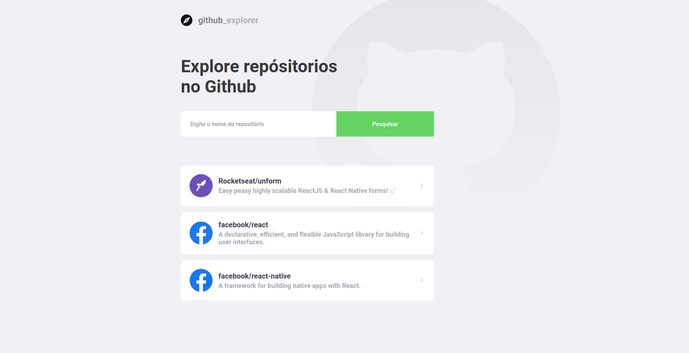
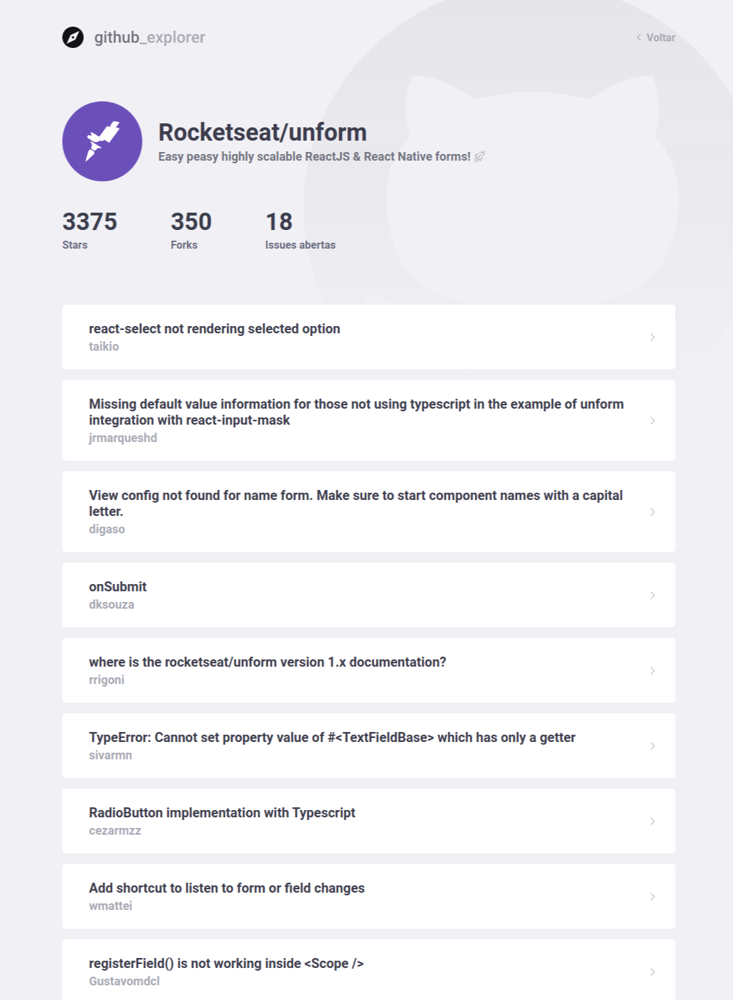

<h1 align="center">
     
</h1>

<h3 align="center">
 Github Issue Explore
</h3>

Allows you to add an existing project on github to show all issues that the project has.

  <a href="#rocket-technologies">Technologies</a>&nbsp;&nbsp;&nbsp;|&nbsp;&nbsp;&nbsp;
  <a href="#-how-to-use">How to use</a>&nbsp;&nbsp;&nbsp;|&nbsp;&nbsp;&nbsp;
  <a href="#memo-license">License</a>

  

  
  
  

 
 

## :rocket: Technologies

 
This app features all the latest tools and practices in web development!
 
 

- [React](https://reactjs.org)
- [TypeScript](https://www.typescriptlang.org)
- [Styled Components](https://styled-components.com)

 

## 📢 How to use

 

**💻 Frontend (React Js)**

 

Step 1 - Access our application's frontend folder;

Step 2 - Download the npm packages used in the project with the command: `npm` , if you prefer yarn execute `yarn`;

Step 3 - Start the application with the command: `npm run start`, if you prefer yarn run `yarn start`;

 

## :memo: License

 
This project is licensed under the MIT License - see the details in <a href="https://opensource.org/licenses/MIT">license page</a>.

---
Make with :purple_heart:
